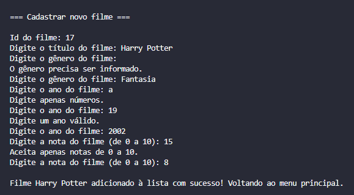
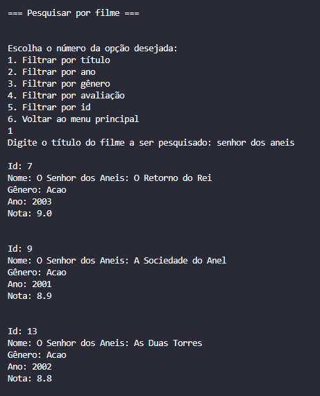
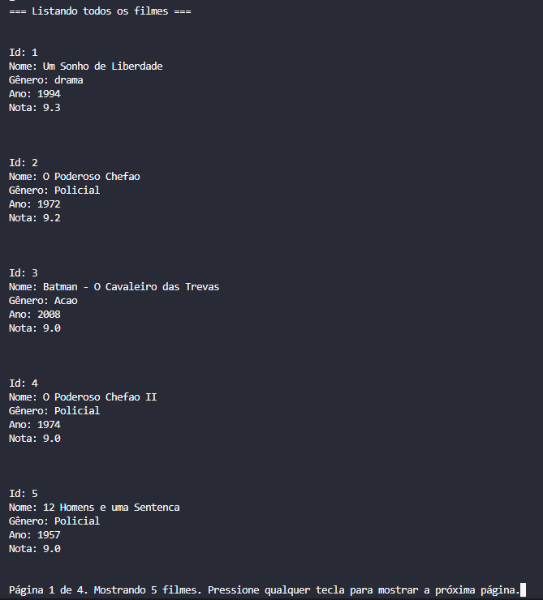

# Gerenciador de acervo de filmes 🎬

Este projeto consiste em um programa que permite armazenar, consultar, deletar e alterar filmes de uma base de dados.

### Requisitos obrigatórios
- ✔ O sistema precisa incluir informações de título, gênero, ano e avaliação dos filmes.
- ✔ CRUD: O sistema precisa incluir funções de criar, atualizar, listar, deletar e pesquisar filmes.

### Adicionais
- ✔ Serialização dos dados em json ou formato desejado
- ✔ Listagem paginada
- ✔ Listagem com agrupamento por gênero, ano ou avaliação
- ❌ Teste unitário

### Como configurar o ambiente
1. Ter o Python instalado no seu computador (para o desenvolvimento dessa aplicação foi usada a versão 3.11.2).

2. Clonar o repositório:
```bash
git clone https://github.com/viquiiz/python-gestao-filmes.git
``` 

3. Abrir a pasta na IDE de sua escolha e instalar as bibliotecas contidas no arquivo requirements.txt via terminal:
```bash
pip install -r requirements.txt
```

### Como rodar
1. Na pasta raiz do projeto, rodar o arquivo main.py:
```bash
python main.py
```

<hr>

### Exemplos de uso

1. Exemplo de cadastro:



Neste caso temos um exemplo onde o usuário inclui um novo filme ao banco de dados passando por diversas etapas de validação, como por exemplo: o título e gênero não podem ficar em branco, os campos ano e nota apenas aceitam números, o ano precisa ser um número de quatro dígitos e a nota precisa estar entre zero e 10. 

<br>

2. Exemplo de exclusão:


No exemplo acima o usuário escolhe um id de filme para ser excluído do banco de dados, no caso, o id número 1. As informações do filme em questão são exibidas na tela para que seja feita uma confirmação da exclusão ou não do filme.

<br>

3. Exemplo de pesquisa:



Nesta terceira imagem é mostrado um exemplo de pesquisa por título do filme. Ao fazer a pesquisa por "senhor dos aneis" são exibidos todos os filmes em que se encontra essa correspondência no título. Também seria possível fazer a pesquisa por ano, gênero, avaliação ou id dos filmes. Ao clonar esse repositório, o arquivo json já trás alguns filmes cadastrados para testar a pesquisa. 

<br>

4. Exemplo de listagem:



Por fim, este exemplo mostra como é apresentada a listagem de todos os filmes na aplicação, com paginação exibindo 5 resultados por vez e contagem de páginas no final do print.